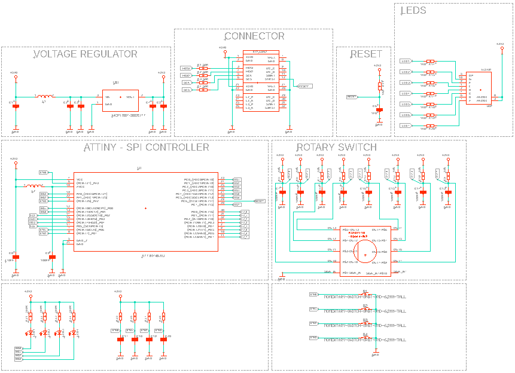
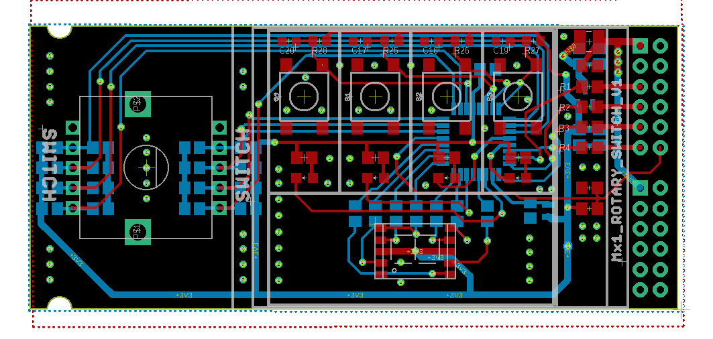

# Expansion odule : 8-position rotary switch and 4 buttons 

Control Input Module for Smartboard

## Overview
This repository hosts the design and implementation details of a Control Input Module for the smartboard. Incorporating an 8-position rotary switch, 4 buttons, and a single digit 7-segment display, this module is powered by an ATtiny48 microcontroller. It is designed to serve as a versatile control interface for smartboard applications, utilizing two smartboard connectors for enhanced functionality.

## Key Features
- **8-Position rotary Switch and 4 Buttons**: Provides a comprehensive set of inputs for control and selection tasks.
- **Single Digit 7-Segment Display**: Offers visual feedback for settings or values.
- **ATtiny48 Microcontroller**: A compact, low-power microcontroller from Microchip, known for its versatility and efficiency in handling I/O operations, making it ideal for embedded applications.
- **Smartboard Compatibility**: Designed to connect seamlessly with two smartboard connectors, facilitating easy integration with existing systems.
- **Customizable Input Handling**: The ATtiny48 allows for flexible programming to accommodate various input scenarios and application requirements.

### Schematic

*Detailed schematic showing the connections between the ATtiny48, the switch, buttons, and the 7-segment display.*

### Board Design

*A visual representation of the PCB layout, highlighting the placement of the ATtiny48, the input controls, and the display.*

## Programming and Configuration
The ATtiny48 microcontroller can be programmed via the ISP interface, allowing for easy customization of the module's behavior. Users can develop and upload their own firmware to tailor the module's operation for specific applications or to add new features.

## Contributions and Feedback
Contributions to this project are welcome. If you have suggestions for improvement or have developed additional features, please fork the repository, make your changes, and submit a pull request. For any questions or issues, please open an issue in the GitHub repository.

## License
This charger project is licensed under the MIT License with the following terms:

- **Permission to Use**: You are free to use, modify, and distribute this charger design in both private and commercial settings.
- **Attribution Requirement**: While not required, attribution to the original author, Adam Łuczak, is appreciated. This can be done through a citation or a link back to this repository.
- **No Warranty**: This design is provided "as is", without warranty of any kind. Use it at your own risk.
- **Liability**: The author is not liable for any damages or losses that may arise from the use of this design.

For the full terms and conditions, please refer to the MIT License documentation.

## Contact
Should you have any inquiries or suggestions regarding this charger project, please don't hesitate to contact Adam Łuczak at adam.luczak@outlook.com.
